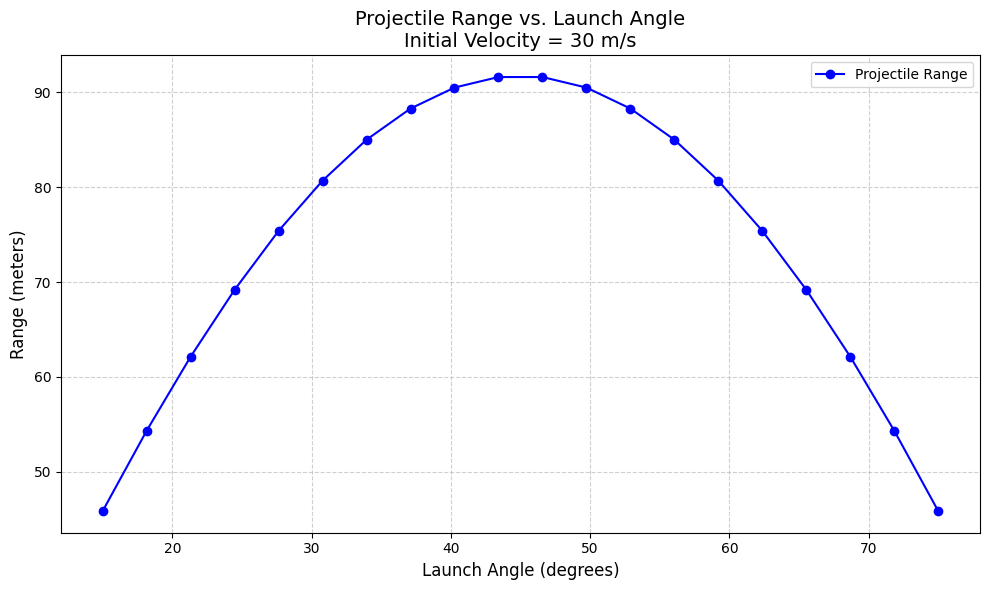

# Problem 2

# Problem 1

## 📘 1. Theoretical Foundation

---

### 🔧 Governing Equation

The motion of a **forced damped pendulum** is governed by the second-order nonlinear differential equation:

$$
\frac{d^2\theta}{dt^2}+b\frac{d\theta}{dt}+\frac{g}{L}\sin\theta=A\cos(\omega t)
$$

Where:
- $\theta(t)$ is the angular displacement as a function of time.
- $b$ is the damping coefficient.
- $g$ is the gravitational acceleration.
- $L$ is the length of the pendulum.
- $A$ is the amplitude of the external driving force.
- $\omega$ is the angular frequency of the external force.

This equation captures:
- The **restoring torque** from gravity: $\frac{g}{L}\sin\theta$.
- The **damping torque**: $b\frac{d\theta}{dt}$.
- The **external driving torque**: $A\cos(\omega t)$.

---

### 🧪 Small-Angle Approximation

For small oscillations where $\theta\ll1$ (in radians), we can linearize the sine term using the Taylor expansion:

$$
\sin\theta\approx\theta-\frac{\theta^3}{6}+\cdots\approx\theta
$$

Thus, the equation becomes:

$$
\frac{d^2\theta}{dt^2}+b\frac{d\theta}{dt}+\frac{g}{L}\theta=A\cos(\omega t)
$$

This is a **linear nonhomogeneous differential equation** with constant coefficients.

---

### 🧮 Analytical Solution of the Linearized Equation

The general solution to the linearized equation:

$$
\frac{d^2\theta}{dt^2}+b\frac{d\theta}{dt}+\omega_0^2\theta=A\cos(\omega t)
$$

Where $\omega_0=\sqrt{\frac{g}{L}}$ is the **natural frequency** of the pendulum.

#### 🔹 Solution Structure

The complete solution is:

$$
\theta(t)=\theta_{\text{hom}}(t)+\theta_{\text{part}}(t)
$$

- **Homogeneous solution** (transient response):

$$
\theta_{\text{hom}}(t)=e^{-\frac{b}{2}t}\left(C_1\cos(\omega_d t)+C_2\sin(\omega_d t)\right)
$$

where $\omega_d=\sqrt{\omega_0^2-\left(\frac{b}{2}\right)^2}$ is the damped natural frequency.

- **Particular solution** (steady-state response):

$$
\theta_{\text{part}}(t)=B\cos(\omega t-\delta)
$$

With:
- $B=\frac{A}{\sqrt{(\omega_0^2-\omega^2)^2+b^2\omega^2}}$ (steady-state amplitude)
- $\delta=\tan^{-1}\left(\frac{b\omega}{\omega_0^2-\omega^2}\right)$ (phase lag)

---

### 🎯 Resonance Condition

Resonance occurs when the **driving frequency** approaches the system's **natural frequency**:

- For low damping:
  $$
  \omega_{\text{res}}\approx\omega_0=\sqrt{\frac{g}{L}}
  $$

- With damping, the **resonance frequency** shifts to:
  $$
  \omega_{\text{res}}=\sqrt{\omega_0^2-\frac{b^2}{2}}
  $$

#### 🔸 At resonance:
- The amplitude $B$ reaches a maximum.
- The system absorbs energy efficiently from the external force.
- This can lead to **very large oscillations**, especially in low-damping systems.

---

### 🔋 Energy Behavior

The **total mechanical energy** of the pendulum is:

$$
E(t)=\frac{1}{2}mL^2\left(\frac{d\theta}{dt}\right)^2+mgL(1-\cos\theta)
$$

# 🌀 2. Analysis of Dynamics

This section explores how different system parameters influence the motion of a forced damped pendulum.

---

## 🔧 Parameters of Interest

- **Damping Coefficient** $b$
- **Driving Amplitude** $A$
- **Driving Frequency** $\omega$

We simulate and analyze the pendulum’s behavior under these variations.

---

## 🧪 Governing Equation

The equation of motion is:

$$
\frac{d^2\theta}{dt^2}+b\frac{d\theta}{dt}+\frac{g}{L}\sin\theta=A\cos(\omega t)
$$

Where:
- $b$ is the damping coefficient  
- $A$ is the driving amplitude  
- $\omega$ is the driving frequency

---

## 🧰 Simulation Setup

We use the **Runge-Kutta method** via `scipy.integrate.solve_ivp` to solve the nonlinear ODE numerically.

The Python implementation includes:
- A model function
- A simulation wrapper
- Phase space plotting for:
  - Varying $b$
  - Varying $A$
  - Varying $\omega$

---

## 📊 Observations

### 1. **Varying Damping Coefficient $b$**
- Low $b$: Oscillations persist longer, chaotic behavior possible  
- High $b$: System rapidly stabilizes or dies out  
- Moderate $b$: Shows transition from regular to quasiperiodic/chaotic  

### 2. **Varying Driving Amplitude $A$**
- Small $A$: Almost harmonic oscillations  
- Large $A$: More energy injected, often leading to **period doubling** or **chaos**

### 3. **Varying Driving Frequency $\omega$**
- Near resonance $\omega\approx\sqrt{g/L}$: High amplitude oscillations  
- Off-resonance: Smaller or more irregular oscillations  

---

## ⚠️ From Order to Chaos

We can witness:

- **Regular Motion**: Clear, periodic cycles  
- **Quasiperiodic**: Loops with subtle non-repeating behavior  
- **Chaotic**: Highly sensitive, seemingly random, no repetition  

These transitions are closely linked to:
- **Bifurcations**  
- **Sensitive dependence on initial conditions**  
- **Phase space topology**

---

## 🔁 Physical Interpretation

- **Synchronization**: When pendulum oscillates in sync with driving force  
- **Period Doubling**: Each cycle takes twice as long → precursor to chaos  
- **Chaos**: Unpredictable, non-repeating, bounded dynamics  

---

# Practical Applications of Forced Damped Pendulum

# Markdown notes

# 🔧 3. Practical Applications

The dynamics of a forced damped pendulum are not just academic—they appear in a wide range of engineering and physical systems.

---

## 🌍 Real-World Systems with Similar Dynamics

- **Energy Harvesting Devices**  
  Use mechanical oscillations to convert vibrational energy into electrical power.

- **Suspension Bridges and Mechanical Structures**  
  Experience forced oscillations due to wind, traffic, or earthquakes—sometimes leading to resonance.

- **Oscillating Electronic Circuits**  
  RLC circuits show the same mathematical structure: damping (resistance), restoring force (capacitance/inductance), and driving voltage.

---

## 🔋 Energy Harvesting

- Systems designed to convert kinetic energy into usable electric energy.
- Examples: piezoelectric generators and electromagnetic harvesters.

### 📈 Model Mapping
- Oscillator: pendulum mass or flexible beam
- Damping: mechanical friction or electrical loss
- Driving Force: external vibrations from environment

The motion equation:

$$
\frac{d^2x}{dt^2}+b\frac{dx}{dt}+\omega_0^2x=A\cos(\omega t)
$$

- $x(t)$: displacement of the energy harvester
- $b$: damping from internal resistance or air drag
- $\omega_0$: natural frequency
- $A$: amplitude of ambient vibration

**Goal:** Tune $\omega$ near $\omega_0$ to maximize energy absorption.

---

## 🌉 Suspension Bridges

- Exhibit forced oscillations due to wind, pedestrians, or traffic.
- Famous case: **Tacoma Narrows Bridge** collapse (1940).

### 📈 Model Mapping
- Bridge as a continuous or lumped mass system
- Damping from internal structure and air
- Driving force from periodic wind gusts or synchronized steps

Equation form:

$$
\frac{d^2\theta}{dt^2}+b\frac{d\theta}{dt}+\frac{g}{L}\theta=A\cos(\omega t)
$$

- $\theta(t)$: angular displacement of bridge segment
- $b$: damping due to friction and structure
- $A\cos(\omega t)$: external wind or excitation

---

## 🔄 Oscillating Electronic Circuits

- RLC circuits follow same second-order dynamics:

$$
L\frac{d^2q}{dt^2}+R\frac{dq}{dt}+\frac{q}{C}=V_0\cos(\omega t)
$$

- $q(t)$: charge on capacitor
- $R$: resistance (damping)
- $L$: inductance (inertia)
- $1/C$: spring constant analogy
- $V_0\cos(\omega t)$: driving voltage

### 🧠 Insight
- Like pendulums, these circuits exhibit:
  - Resonance at $\omega=1/\sqrt{LC}$
  - Energy storage in electric and magnetic fields
  - Damped oscillations due to $R$

---

## ✅ Summary

- The forced damped pendulum model applies broadly:
  - Mechanical, structural, and electrical systems
- Universal features:
  - Nonlinearity
  - Damping vs. driving competition
  - Resonance and chaos

These insights guide design and safety in engineering.
---

# Python/Plot


---

---

---

---

---

---

---

---

---


```python
import numpy as np
import matplotlib.pyplot as plt
from scipy.integrate import solve_ivp

# Constants
L = 1.0        # Length of pendulum (m)
g = 9.81       # Gravity (m/s^2)

# Function for Pendulum RHS (Right-Hand Side)
def pendulum_rhs(t, y, damping, drive_amplitude, drive_freq):
    theta, omega_theta = y
    dtheta_dt = omega_theta
    domega_dt = -damping * omega_theta - (g / L) * np.sin(theta) + drive_amplitude * np.cos(drive_freq * t)
    return [dtheta_dt, domega_dt]

# Function for Simulating Pendulum
def simulate_pendulum(damping, drive_amplitude, drive_freq, initial_theta, initial_omega, t_max=100, dt=0.01):
    t_span = (0, t_max)
    t_eval = np.arange(0, t_max, dt)
    y0 = [initial_theta, initial_omega]
    sol = solve_ivp(pendulum_rhs, t_span, y0, t_eval=t_eval, args=(damping, drive_amplitude, drive_freq), method='RK45')
    return sol.t, sol.y[0], sol.y[1]

# Plotting Time Series (angular displacement)
def plot_time_series(t, theta, title="Time Series"):
    plt.figure(figsize=(10, 4))
    plt.plot(t, theta, color='blue')
    plt.title(title)
    plt.xlabel("Time (s)")
    plt.ylabel("Theta (rad)")
    plt.grid(True)
    plt.tight_layout()
    plt.show()

# Plotting Phase Portrait (theta vs omega)
def plot_phase_portrait(theta, omega, title="Phase Portrait"):
    plt.figure(figsize=(6, 6))
    plt.plot(theta, omega, color='green')
    plt.title(title)
    plt.xlabel("Theta (rad)")
    plt.ylabel("Angular Velocity (rad/s)")
    plt.grid(True)
    plt.tight_layout()
    plt.show()

# --- Scenarios ---
# Shared initial conditions
initial_theta = 0.1  # Initial angle
initial_omega = 0.0  # Initial angular velocity

# --- Scenario 1: Simple Pendulum (No damping, no force) ---
t, theta, omega = simulate_pendulum(0.0, 0.0, 0.0, initial_theta, initial_omega)
plot_time_series(t, theta, title="Simple Pendulum (No damping, No force)")
plot_phase_portrait(theta, omega, title="Simple Pendulum Phase Portrait")

# --- Scenario 2: Pendulum with Damping ---
t, theta, omega = simulate_pendulum(0.1, 0.0, 0.0, initial_theta, initial_omega)
plot_time_series(t, theta, title="Pendulum with Damping")
plot_phase_portrait(theta, omega, title="Pendulum with Damping Phase Portrait")

# --- Scenario 3: Pendulum with External Force ---
t, theta, omega = simulate_pendulum(0.0, 1.0, 2.0, initial_theta, initial_omega)
plot_time_series(t, theta, title="Pendulum with External Force")
plot_phase_portrait(theta, omega, title="Pendulum with External Force Phase Portrait")

# --- Scenario 4: Pendulum with Damping and External Force ---
t, theta, omega = simulate_pendulum(0.1, 1.0, 2.0, initial_theta, initial_omega)
plot_time_series(t, theta, title="Pendulum with Damping and External Force")
plot_phase_portrait(theta, omega, title="Pendulum with Damping and External Force Phase Portrait")

# --- Scenario 5: Resonance or Chaos (Driving at resonant frequency) ---
resonant_freq = np.sqrt(g / L)
t, theta, omega = simulate_pendulum(0.1, 1.0, resonant_freq, initial_theta, initial_omega)
plot_time_series(t, theta, title="Resonant Scenario (Pendulum with Damping and External Force)")
plot_phase_portrait(theta, omega, title="Resonant Scenario Phase Portrait")
```

